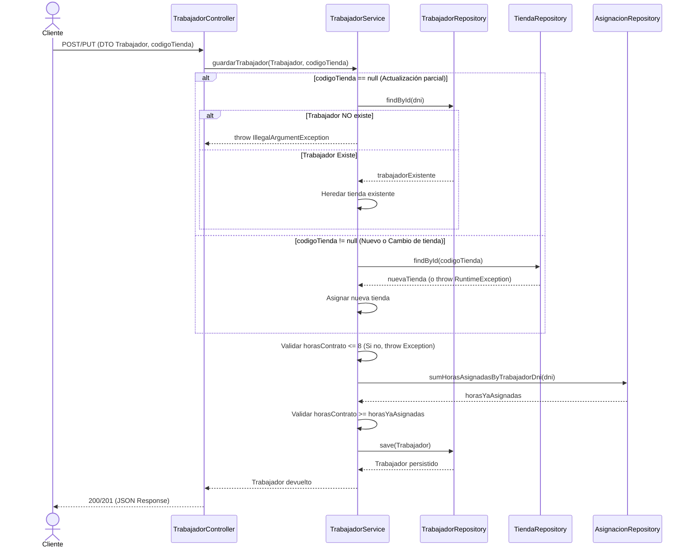
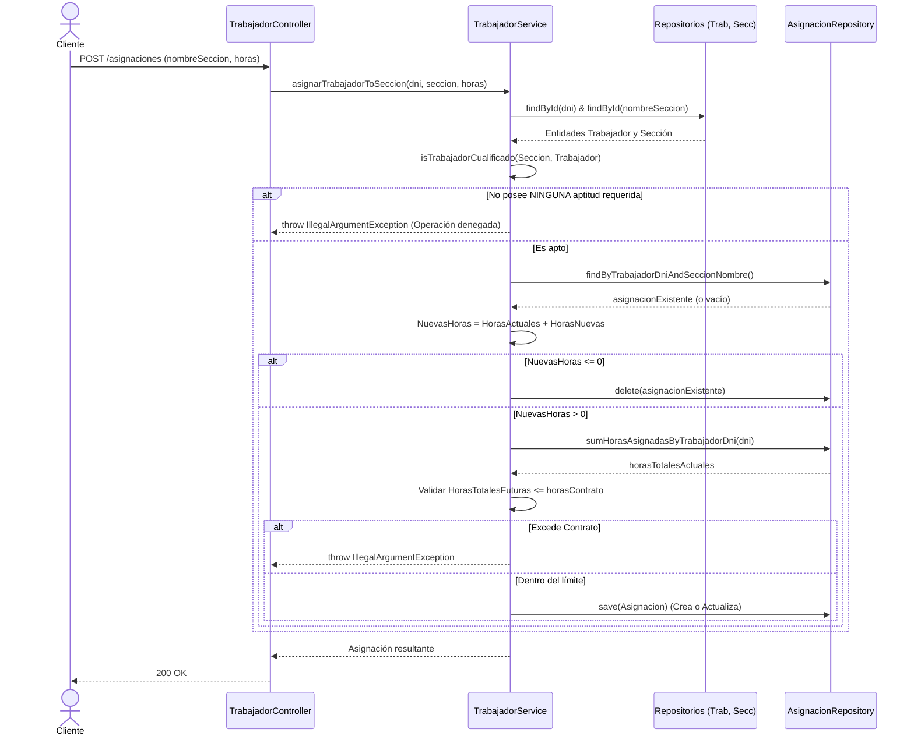
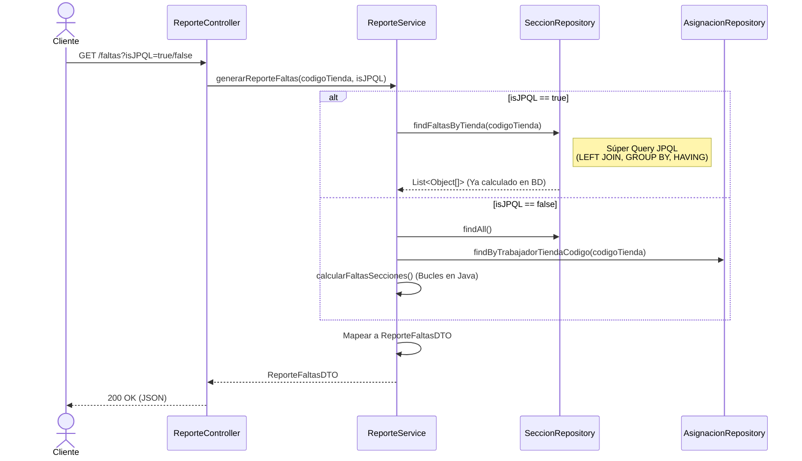
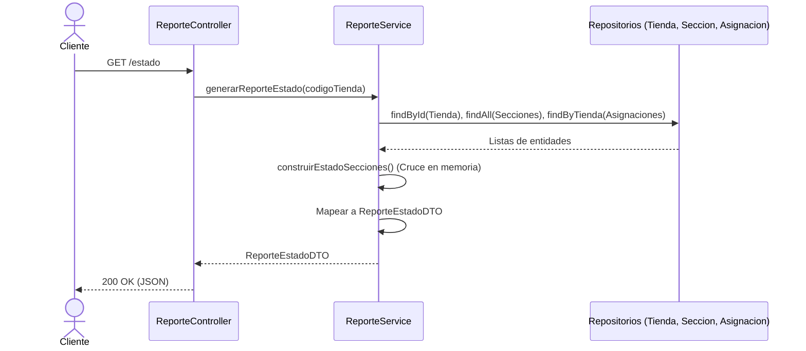
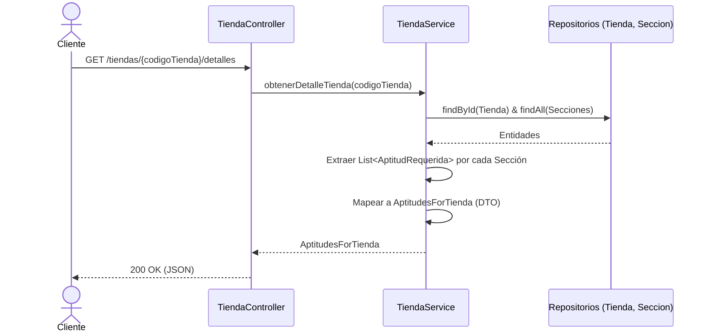

# Prueba Técnica Mercadona - Gestión de Tiendas y Trabajadores

Este proyecto es una API RESTful desarrollada en Java con Spring Boot para la gestión de supermercados, trabajadores, secciones y asignaciones de horarios, cumpliendo con los requisitos de la prueba técnica solicitada.

## Tecnologías Utilizadas
* **Java 17+**
* **Spring Boot 3.x** (Web, Data JPA)
* [cite_start]**H2 Database**: Base de datos en memoria para facilitar las pruebas sin instalaciones externas[cite: 11].
* [cite_start]**Maven**: Gestor de dependencias utilizado por su estructura universal y estándar[cite: 7, 8].
* **JUnit 5 & Mockito**: Para pruebas unitarias y de integración.

---

## Instrucciones de Ejecución

1. **Clonar o descargar** el proyecto en tu máquina local.
2. **Importar el proyecto** en tu IDE favorito (Eclipse, IntelliJ, VSCode) como un proyecto Maven existente.
3. Ejecutar la clase principal `MercadonaPruebaApplication.java`.
4. La aplicación arrancará en el puerto `8081` (modificado desde el 8080 para evitar conflictos de red).

### Acceso a la Base de Datos (Consola H2)
Para comprobar los datos en vivo, puedes acceder a la consola de la base de datos en memoria a través de tu navegador:
* [cite_start]**URL:** [http://localhost:8081/h2-console](http://localhost:8081/h2-console) [cite: 34]
* [cite_start]**JDBC URL:** `jdbc:h2:mem:mercadonadb` [cite: 34]
* **User / Password:** `sa` / *(dejar en blanco)*

### Datos de Prueba Iniciales
[cite_start]Tal y como requiere el ejercicio [cite: 142][cite_start], la aplicación arranca con un set de datos de prueba inyectados automáticamente a través del archivo `data.sql`[cite: 33]. [cite_start]Estos datos incluyen tiendas (ej. Mercadona Ruzafa), las secciones obligatorias, aptitudes, y un par de trabajadores con horas ya asignadas para facilitar la validación inmediata de los endpoints[cite: 102, 129].

---

## Colección de Postman

En la raíz de este proyecto encontrarás un archivo llamado `mercadona-prueba.postman_collection.json`. 
[cite_start]Para probar la API[cite: 94]:
1. Abre Postman.
2. Haz clic en **Import** y selecciona este archivo.
3. Recomiendo ejecutar las pruebas de Postman en el orden en que aparecen. Dejando para el final los Delete, dado que estos quitan información de la base de datos que podría ser útil para los cálculos de los reportes.

---

## Decisiones Arquitectónicas y de Diseño

Durante el desarrollo se han tomado decisiones arquitectónicas clave para garantizar un código escalable, limpio y seguro:

* **Domain-Driven Design (DDD) en Asignaciones:** La lógica de validación de horas se ha centralizado en `TrabajadorService`. [cite_start]Al ser el trabajador el propietario de sus horas de contrato, es su servicio el que orquesta y valida las reglas de negocio, evitando invertir la jerarquía natural[cite: 40, 42, 43].
* [cite_start]**Single Responsibility Principle (SRP) en Reportes:** En lugar de sobrecargar los servicios de entidades básicas, se ha creado un `ReporteService` y `ReporteController` dedicados exclusivamente a cruzar datos de lectura para generar los informes estadísticos[cite: 54, 55, 56].
* **Uso de DTOs y Mappers:** La capa de presentación está totalmente aislada del modelo de base de datos. [cite_start]Esto evita bucles infinitos en la serialización JSON [cite: 45, 47] [cite_start]y protege la estructura interna de la base de datos[cite: 48, 49].
* [cite_start]**Global Exception Handler (`@RestControllerAdvice`):** Actúa como un interceptor global que captura excepciones de negocio (`IllegalArgumentException`) y las transforma en respuestas JSON estructuradas y limpias (ej. `400 Bad Request`), ocultando la traza del servidor por motivos de seguridad[cite: 35, 38].

---

## Estado de las Iteraciones

* ✅ **Iteración 1 (Desarrollo Básico):** Completada. [cite_start]API CRUD completa de trabajadores y sistema de asignación con validación estricta de 8 horas máximas[cite: 104, 108, 110].
* ✅ **Iteración 2 (Reportes):** Completada. [cite_start]Generación de informes de Estado y Faltas[cite: 116, 117].
* ⏭️ **Iteración 3 (Integración Docker):** Omitida. [cite_start]No se pudo realizar por incompatibilidad del Sistema Operativo con Docker Desktop. *Nota: Esta limitación técnica se ha compensado ampliando la calidad y profundidad del resto del código mediante Funcionalidades Adicionales.*
* ✅ **Iteración 4 (Ampliación de Modelo - Aptitudes):** Completada. [cite_start]Se ha modificado el modelo lógico utilizando relaciones `@ManyToMany` para añadir listas de aptitudes a Secciones y Trabajadores[cite: 132].

---

## ⭐ Funcionalidades Adicionales (Extras implementados)

[cite_start]Para elevar el estándar técnico de la prueba, se han implementado los siguientes extras evaluables[cite: 134, 141]:

1. [cite_start]**Uso de JPQL sobre queries nativas [cite: 140][cite_start]:** El reporte de faltas se ha refactorizado para utilizar una consulta JPQL de alto rendimiento con agrupación (`GROUP BY`), filtrado avanzado (`HAVING`) y `LEFT JOIN`[cite: 68, 71, 74]. [cite_start]Esto evita procesar miles de registros en memoria mediante bucles Java, delegando el esfuerzo matemático (`COALESCE`, `SUM`) directamente al motor de la base de datos[cite: 64, 65, 72].
2. [cite_start]**Validación de Negocio en Iteración 4:** Se ha añadido un validador que bloquea la asignación de un trabajador a una sección si este no posee *al menos una* de las aptitudes requeridas por dicha sección, devolviendo un error controlado[cite: 62, 63].
3. **Testing de Alta Cobertura (JUnit + Mockito):** Se ha diseñado una suite de pruebas unitarias y de integración alcanzando una alta cobertura global. Se han testeado exhaustivamente los casos límite y *happy paths* en la capa de Servicio, el Controlador (`@WebMvcTest`) y el Repositorio de la consulta JPQL customizada (`@DataJpaTest`).

---

## Diagramas de Secuencia

A continuación se detalla el flujo de datos de las operaciones más críticas del sistema. *(Se puede ver en Markdown).*

## Diagramas de Secuencia (Flujo Lógico Detallado)

A continuación se detalla el flujo de datos exacto de las operaciones más críticas del sistema, reflejando las reglas de negocio, validaciones y acceso a base de datos.

### 1. Guardar/Actualizar Trabajador
Este flujo cubre tanto la creación como la edición, teniendo en cuenta la verificación de tienda y los límites de horas de contrato.

### 2. Asignar horas de un Trabajador a una sección
Este flujo cubre la asignacion de horas de un trabajador en una sección

### 3. Reporte de faltas
Este flujo cubre el reporte de las horas faltantes en una tienda clasificado por secciones

### 4. Reporte de estado
Este flujo cubre el reporte de las horas faltantes en una tienda clasificado por secciones

### 5. Reporte de aptitudes
Este flujo cubre el reporte de las aptitudes necesarias para una tienda. *(Como todas las tiendas tienen todas las secciones, se listarán siempre todas las aptitudes).*

---

## Anexo: Experiencia Adicional (Seguridad y Autenticación)

[cite_start]El documento de requisitos menciona la **Autenticación** como una de las funcionalidades adicionales valorables[cite: 139]. [cite_start]Dada la limitación de tiempo y la priorización de una cobertura de tests alta y optimización de base de datos (JPQL), he decidido no incluir esa capa en este proyecto para mantener su simplicidad de ejecución[cite: 140, 142].

No obstante, si el equipo evaluador desea revisar mi experiencia implementando sistemas de seguridad en Spring Boot, pueden a consultar este otro proyecto reciente de mi portfolio personal:

* 🔗 **[Proyecto con Autenticación y Seguridad BD](https://github.com/davidcuestaalario/PortfolioDavid/tree/main/Proyectos/Spring/Ejercicio%20Tecnico)**

En dicho proyecto implemento funcionalidades avanzadas de control de acceso, incluyendo:
* Verificación de identidad contra base de datos.
* Bloqueo de usuarios por exceso de intentos fallidos de inicio de sesión.
* Gestión de sesiones y permisos.

¡Gracias por vuestro tiempo evaluando esta prueba!